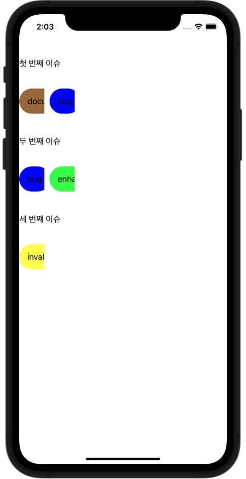

## 1. 계기

코드스쿼드 마지막 팀 프로젝트인 `Issue Tracker`를 진행하다가, CollectionView(Issue Cell)안에 CollectionView(Label Cell)이 있으면 편하게 구현할 수 있겠다고 생각했습니다.

하지만 편할 것이라는 생각과는 다르게, 처음 해보다보니 이 두 CollectionVIew의 DataSource를 관리하는데서 부터 애를 먹기 시작했습니다.

이전에 `Side Dish`같은 프로젝트를 진행할 때에도 `왜 CollectionView가 아닌 ScrollView를 사용하려고 하냐`는 코드 리뷰를 받았는데, 할 줄 모른다는 핑계를 대신해서 프로젝트 요구사항 을 들먹였던 기억이 떠올라, 이번에는 확실히 짚고 넘어가자고 생각해 정리하려고 합니다.


## 2. 모델링


구현해 볼 내용을 간단하게 모델링한 내용은 위와 같습니다. **Issue**에 해당하는 IssueCollectionView의 Cell 내에 해당 Issue에 속해 있는 **Label**들을 보여줄 LabelCollectionView가 있는 형태입니다.


여기서 사용할 타입은 아래와 같이 정의했습니다.

```swift
struct Issue {
	let title: String
    let labels: [Label]
}

struct Label {
    let title: String
    let backgroundColor: UIColor
}
```

IssueCollectionCell에서 사용할 타입은 Issue이고, 이 셀에는 CollectionView가 존재하므로, 해당 CollectionView에서 사용할 데이터(**[Label]**)까지 한 번에 받는 것이 핵심입니다.


## 3. 구현

### 1. LabelCollectionCell

```swift
//  LabelCollectionCell.swift

import SnapKit
import UIKit

final class LabelCollectionCell: UICollectionViewCell {
    static let identifier = String(describing: LabelCollectionCell.self)

    private let labelLabel: PaddingLabel = {
        let label = PaddingLabel()
        label.setEdgeInset(top: 4, bottom: 4, left: 16, right: 16)
        label.translatesAutoresizingMaskIntoConstraints = false
        return label
    }()

    override init(frame: CGRect) {
        super.init(frame: frame)
        addSubview(labelLabel)
    }

    @available(*, unavailable)
    required init?(coder: NSCoder) {
        fatalError("init(coder:) has not been implemented")
    }

    func configure(with label: Label) {
        labelLabel.text = label.title
        labelLabel.backgroundColor = label.backgroundColor
    }

    override func layoutSubviews() {
        super.layoutSubviews()
        labelLabel.snp.makeConstraints { make in
            make.edges.equalTo(self)
        }
    }
}
```


### 2. IssueCollectionCell

이 Cell에서 LabelCollectionView를 갖고 있게 하기 위해, LabelCollectionViewController를 갖고 있습니다.

LabelCollectionView만 가지고 있을 경우, LabelCollectionView에 대한 DataSource, Delegate 모두 해당 Cell에서 담당하게 되는 어색한 상황이 발생했기 때문입니다.

```swift
//  IssueCollectionCell.swift

import UIKit
import SnapKit

final class IssueCollectionCell: UICollectionViewCell {
    static let identifier = String(describing: IssueCollectionCell.self)

    let contentsStackView: UIStackView = {
        let stackView = UIStackView()
        stackView.translatesAutoresizingMaskIntoConstraints = false
        stackView.axis = .vertical
        stackView.spacing = 15
        return stackView
    }()

    private let titleLabel: UILabel = {
        let label = UILabel()
        label.numberOfLines = 0
        label.font = .systemFont(ofSize: 22)
        label.translatesAutoresizingMaskIntoConstraints = false
        label.adjustsFontSizeToFitWidth = true
        return label
    }()

    private let labelCollectionViewController = LabelCollectionViewController()

    private var data = [Label]()

    override init(frame: CGRect) {
        super.init(frame: frame)
        addSubview(contentsStackView)
        contentsStackView.addArrangedSubview(titleLabel)
        contentStackView.addArracgedSubview(labelCollectionViewController.view)
        clipsToBounds = true
    }

    @available(*, unavailable)
    required init?(coder: NSCoder) {
        fatalError("init(coder:) has not been implemented")
    }

    func configure(with issue: Issue) {
        titleLabel.text = issue.title
        data = issue.labels
        contentsStackView.addArrangedSubview(labelCollectionViewController.view)
        configureLabels(with: issue)
    }

    override func layoutSubviews() {
        contentsStackView.snp.makeConstraints { make in
            make.top.bottom.equalTo(self)
            make.width.equalTo(UIScreen.main.bounds.width * 0.8)
            make.centerX.equalTo(self)
        }
    }
}
```


## 4. 문제 해결

### 1. LabelCollectionCell의 간격 문제

`LabelCollectionView`를 초기화할 때 `UICollectionViewFlowLayout`을 설정해주면서 `UICollectionViewFlowLayout.minimumLineSpacing = 10`과 같이 설정을 해주었기 때문에 Cell간 간격이 지정될 것이라고 생각했지만, 제가 원하는 간격이 지정되지 않는 문제가 발생했습니다..🚨

| minimumLineSpacing = 10                                      | minimumLineSpacing = 100                                     |
| ------------------------------------------------------------ | ------------------------------------------------------------ |
|  |  |

minimumLineSpacing 속성을 바꾸어주어도, Cell간 간격에는 달라지는 점이 없었습니다,, 

여기서 찾은 첫번째 문제는, horizontal 방향으로 스크롤되는 CollectionView의 경우, 셀 간격을 조정하기 위해서는 ~~minimumLineSpacing~~이 아니라, `minimumInteritemSpacing` 을 설정해주어야 한다는 것입니다.

```swift
// final class LabelCollectionView: UICollectionView
convenience init() {
    let flowLayout = UICollectionViewFlowLayout()
    flowLayout.minimumInteritemSpacing = 100
    self.init(frame: .zero, collectionViewLayout: flowLayout)
    ...
}
```

작성했던 LabelCollectionView의 설정 값들 중, 위에서 말한 값을 수정해주었더니 아래와 같이 화면이 변경되었습니다!


### 2. LabelCollectionCell의 dynamic width

이제, LabelCollectionCell의 width를 글자의 길이에 맞게 dynamic하게 설정하는 과정이 필요합니다.

Cell의 Layout을 설정하는 객체는 UICollectionViewDelegate, 여기서 UICollectionViewFlowLayout을 이용하면 된다고 판단했습니다.

해당 객체의 `collectionView(_: layout: sizeForItemAt:) -> CGSize` 메소드를 이용해 Cell의 크기를 지정해줄 수 있습니다.

그럼 아직 들어오지 않은 String 값의 **width**를 어떻게 알 수 있을까요? 

`String.size(withAttribute:)` 메소드를 이용해 알 수 있었습니다.

String이 들어갈 UI(저는 UILabel의 길이를 구하려고 합니다.)에서 사용하는 Font 속성을 사용해 width를 아래와 같이 구할 수 있습니다.

```swift
String.size(withAttribute: [NSAttributedString.Key.font: .systemFont(ofSize: 17)])
```

위 코드를 이용해 UICollectionViewDelegateFlowLayout 객체를 완성했습니다.

```swift
extension IssueCollectionCell: UICollectionViewDelegateFlowLayout {
    func collectionView(_ collectionView: UICollectionView, layout collectionViewLayout: UICollectionViewLayout, sizeForItemAt indexPath: IndexPath) -> CGSize {
        return CGSize(width: data[indexPath.item].title.size(withAttributes: [NSAttributedString.Key.font: UIFont.systemFont(ofSize: 17)]).width + 32, height: 50)
    }
}
```

이제 원하는 화면이 나오는 것을 확인할 수 있었습니다!


---

(길이가 너무 길어져, [2편](https://hansolkkim.github.io/posts/CollectionViewInCollectionView-2)에서 마저 작성하겠습니다! 2편에는 CollectionView Dynamic Height를 중점으로 작성합니다.)

## 5. 참고 자료

- [[StackOerflow-Dynamic cell width of UICollectionView depending on label width]](https://stackoverflow.com/questions/23134986/dynamic-cell-width-of-uicollectionview-depending-on-label-width)