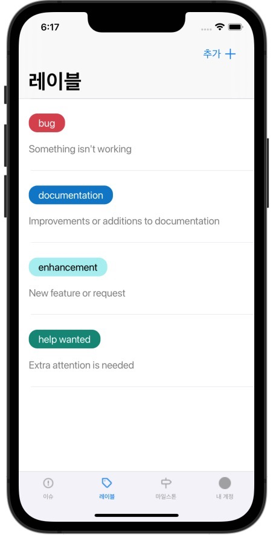

## 계기

UITableView는 Cell의 Subview들의 Constraints만 잘 잡아주면 Cell의 높이가 동적으로 설정되는 기능을 이용하려 했습니다.

그런데 아무리해도 Cell의 높이는 **45** point로 그대로였고, 이거 떄문에 2시간동안 Constraints만 엄청 수정했습니다..

포기하고 자려고 하다가, 자기 직전에 요즘 버릇인 UIView 내의 `layoutSubviews()` 메소드에서 Subview들의 Constraints를 잡아주던게 떠올라, Subview들의 Constraints 설정하는 코드를 모두 초기화 생성자로 옮겼더니 그제서야 TableView Cell의 높이가 동적으로 설정되었습니다..

(완성된 내 TableView! 다 하고보니 동적 높이 Cell은 필요없었다..)

아무튼 `layoutSubview()` 메소드를 사용해서 문제가 생겼던 탓에, View의 Layout 업데이트 관련 메소드와 View의 Life-Cycle에 관련해 알아보려고 합니다!

## iOS Layout

> Demystifying iOS Layout - [[1]] 포스팅의 일부를 번역했습니다.

### Update Cycle(업데이트 주기)

**Update Cycle**은 앱이 모든 이벤트 처리 코드를 실행한 후 Main run loop로 컨트롤을 넘겨주는 시점입니다.

이 시점에서 시스템은 **Layout**, **Display** 및 **Constraints**를 업데이트하기 시작합니다. 이벤트 handler를 처리하는 동안 View의 변경을 요청한다면, 시스템은 해당 View를 redraw가 필요한 것으로 표시해놓습니다._(the sysytem will mark the view as needing redraw.)_ 그리고 다음 Update Cycle에서 시스템은 표시된 View들의 변경 사항을 실행합니다.

Update Cycle은 60[fps]로 동작하기 때문에 사용자는 UI 업데이트 지연을 느끼지는 못하지만, `이벤트가 처리되는 시점`과 `해당 뷰를 다시 그리는 시점` 사이의 interval 때문에 우리가 원하는 Run Loop의 시점에 뷰가 업데이트되지 않을 수도 있습니다. 

따라서 **Run Loop**, **Update Cycle** 및 **UIView의 특정 메소드**를 이해하면 이러한 종류의 문제를 방지하거나 디버깅하는데 도움이 될 수 있습니다.

### Layout

뷰의 Layout은 스크린에서 뷰의 size와 position을 의미합니다.

UIView는 뷰의 Layout이 변경되었음을 시스템에게 알리는 메소드를 제공할 뿐 아니라, 뷰의 Layout이 다시 계산된 후 수행할 작업을 정의하기 위해 오버라이딩할 수 있는 메서드를 제공합니다.

#### layoutSubviews

`layoutSubviews()` 메소드는 뷰와 모든 Subview들의 위치 조정(repositioning) 및 크기 조정(resizing)을 처리합니다.

해당 메소드는 재귀적으로 해당 뷰의 모든 Subview들의 layoutSubviews() 메소드를 호출하기 때문에 **비용이 많이 드는 메소드**입니다. 시스템은 뷰의 frame을 다시 계산할 때마다 이 메소드를 호출하기 때문에 **frame을 설정하고 위치 및 크기를 조정할 때 이 메서드를 오버라이딩**해야 합니다. 그러나 Layout을 업데이트할 때 `layoutSubviews()` 메소드를 직접 호출하는 것은 금지되어 있습니다. 대신, Run Loop동안 `layoutSubviews()`의 호출을 트리거하는, `layoutSubviews()` 자체를 호출하는 것보다 훨씬 비용이 적은 방법들이 있습니다.

layoutSubviews() 메소드가 완료되면 `viewDidLayoutSubviews()` 메소드에 대한 호출이 해당 뷰를 소유한 뷰 컨트롤러에서 트리거됩니다. `layoutSubviews()`는 뷰의 Layout이 업데이트된 후 안정적으로 호출되는 유일한 메소드이므로, **Layout 및 Sizing에 따라 달라지는 모든 로직을 `viewDidLoad()/ viewWillAppear()`가 아니라, `viewDidLayoutSubviews()`에서 처리해야 합니다**. 이 방법만이 오래된 Layout과 positioning 변수를 다른 계산에서 사용하는 것을 피할 수 있는 유일한 방법입니다.

### Automatic refresh triggers

뷰의 Layout이 변경되었음을 시스템에 알리는 다음 이벤트들은 개발자가 수동으로 수행하지 않고도 다음 기회에 자동으로 `layoutSubviews()`가 호출됩니다.

- 뷰를 Resizing하는 이벤트
- Subview 추가하는 이벤트
- 유저가 UIScrollView를 스크롤하는 이벤트 (UIScrollView와 그것의 Superview의 layoutSubviews() 호출)
- 디바이스 회전
- 뷰의 Constraints 변경

위의 이벤트들은 모두 뷰의 위치를 다시 계산해야한다는 것을 시스템에 전달하고, 자동으로 최종 `layoutSubviews()`의 호출로 이어집니다. 하지만 `layoutSubviews()`를 직접 트리거하는 다음 방법들도 있습니다.

#### setNeedsLayout()

`setNeedsLayout()` 메소드는 `layoutSubviews()`를 트리거하는 가장 비용이 적은 메소드입니다. 이 메소드는 뷰의 Layout을 다시 계산되어야함을 시스템에 알려줍니다.

하지만 `setNeedsLayout()` 메소드는 즉시 실행되고 반환되지만, 반환되기 전에 뷰를 실제로 업데이트하지는 않습니다. 대신, 시스템이 **다음 Update Cycle에서** 해당 뷰와 모든 Subview들의 `layoutSubviews()`를 호출하게 합니다. 

#### layoutIfNeeded()

`layoutIfNeeded()` 메소드가 호출되면 **뷰의 Layout 업데이트가 필요한 경우 시스템은 즉시 `layoutSubviews()`를 호출합니다.** 하지만 뷰를 업데이트해야하는 경우가 아닐 때에 해당 메소드가 호출될 경우에는 `layoutSubviews()`가 호출되지 않습니다.(LayoutIfNeeded()가 동일한 Update Cycle동안 두 번 호출될 경우에도 두 번째 호출은 `layoutSubviews()`를 트리거하지 않음.)

`layoutIfNeeded()` 메소드는 위의 setNeedsLayout() 메소드와는 다르게, 메소드가 반환되기 전에 해당 뷰와 Subview들을 다시 그리고 Layout이 업데이트됩니다. 이 메소드는 다음 Update Cycle까지 기다릴 수 없는 경우(새로운 Layout에 의존해야하는 때)에 유용하지만, 이런 경우가 아니라면 `setNeedsLayout()` 메소드를 호출해 Run Loop당 한 번 뷰를 업데이트하는 것이 이상적입니다.

`layoutIfNeeded()` 메소드는 Constraints에 대한 변경을 애니메이션하는 상황에서 특히 유용합니다. 애니메이션이 시작되기 전에 모든 Layout 업데이트가 전달되어야 한하는 상황에는 애니메이션 블록이 실행되기 전에 `layoutIfNeeded()` 메소드를 호출해야 합니다. 새로운 Contraints를 설정하고, 애니메이션 블록 안에서는 또 `layoutIfNeeded()`를 호출해 애니메이션이 새로운 상태로 진행되도록 해야합니다.

### 참고 자료

- [[Demystifying iOS Layout]](https://tech.gc.com/demystifying-ios-layout){:target="_blank"}

[1]: https://tech.gc.com/demystifying-ios-layout/